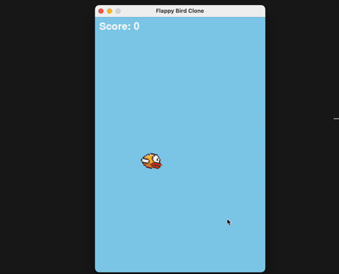

# Vibe Coding Games

<table>
  <tr>
    <td valign="middle">
      
    </td>
    <td valign="top" width="60%" style="padding-left: 20px;">
      This is just me having some fun throwing together games quickly. The tower defense
      one is probably the most expansive example.
      <br><br><b>Games:</b><br>
      - Flappybird (2 prompts)<br>
      - Tetris (5 prompts)<br>
      - Tower Defense (Many prompts)<br>
    </td>
  </tr>
</table>


## Get Started

```bash
./play.sh flappybird
./play.sh tetris
./play.sh tower-defense
```


